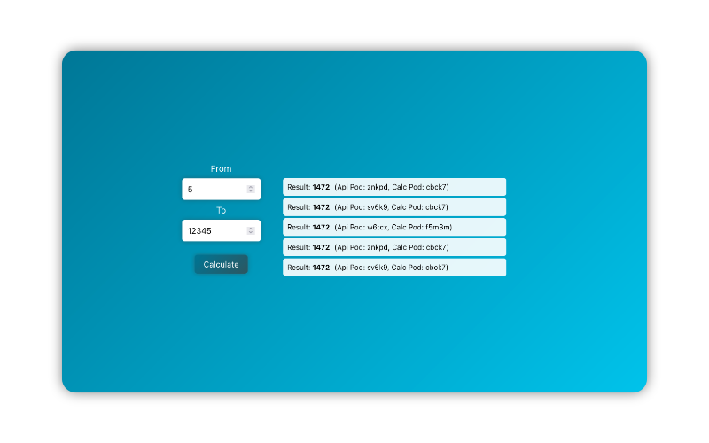
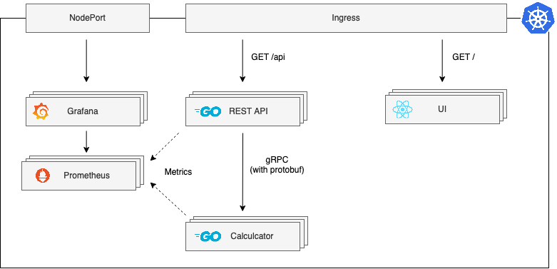

# Distributed Prime Counter



This is a fun project that I made to learn some stuff that I always wanted to get to know better. The application does not have a specific purpose other than that. I especially wanted to see how the scaling and load balancing behaves with K8s, which is why the ui displays the pods where the request went through.

Specifically, I used the following technologies:

* [Kubernetes](https://kubernetes.io/) (using [minikube](https://minikube.sigs.k8s.io) for local development): Container Orchestration / Deployment
* [Go](https://go.dev/): Programming Language
* [gRPC](https://grpc.io/): Service Communication
* [Protocol Buffers](https://developers.google.com/protocol-buffers): Communication Format
* [Earthly](https://earthly.dev/): CI / CD
* [React](https://reactjs.org/): User Interface
* [Prometheus](https://prometheus.io/): Metrics Collection
* [Grafana](https://grafana.com/): Metrics Visualization

## Architectual Overview

This is a very simplified overview of the architecture.



## Getting Started

Using minikube:

```bash
# Setup minikube docker environment
minikube start
eval $(minikube docker-env)

# Build all services
earthly +all-docker

# Allows the access to NodePort and Ingress (Execute this in a seperate terminal)
minikube tunnel

# Deploy the application
kubectl apply -f deploy/
```

Now you should be able to access <http://localhost:80> (for UI and API), <http://localhost:9090/> (for Prometheus) and <http://localhost:4000> (for Grafana).

## Additional Notes

:warning: Currently the Prometheus Deployment is running with a Service Account that has the cluster role `cluster-admin` assigned, which is not recommended for production!